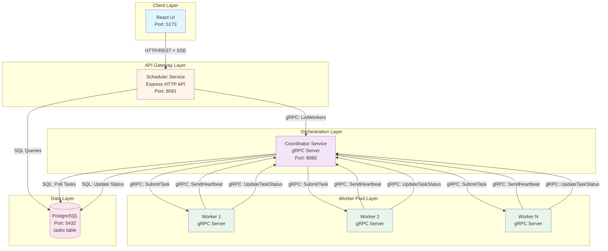
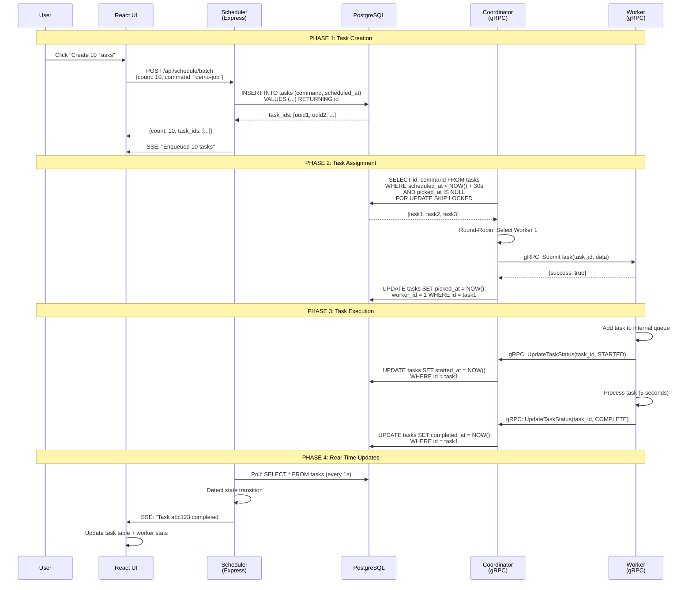
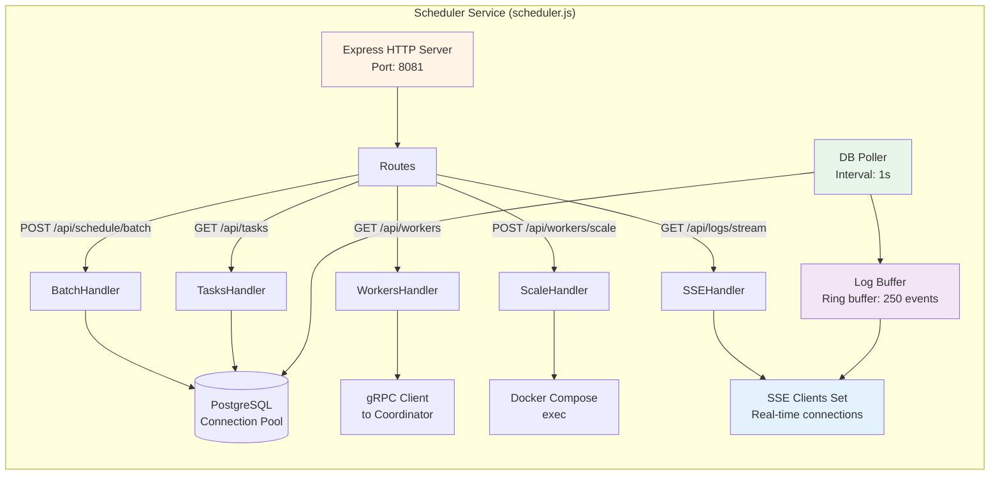
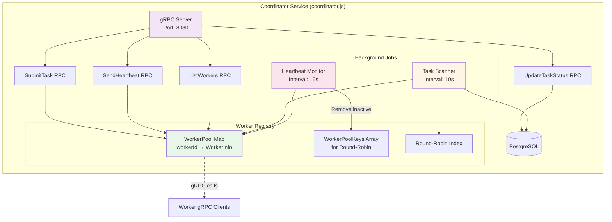
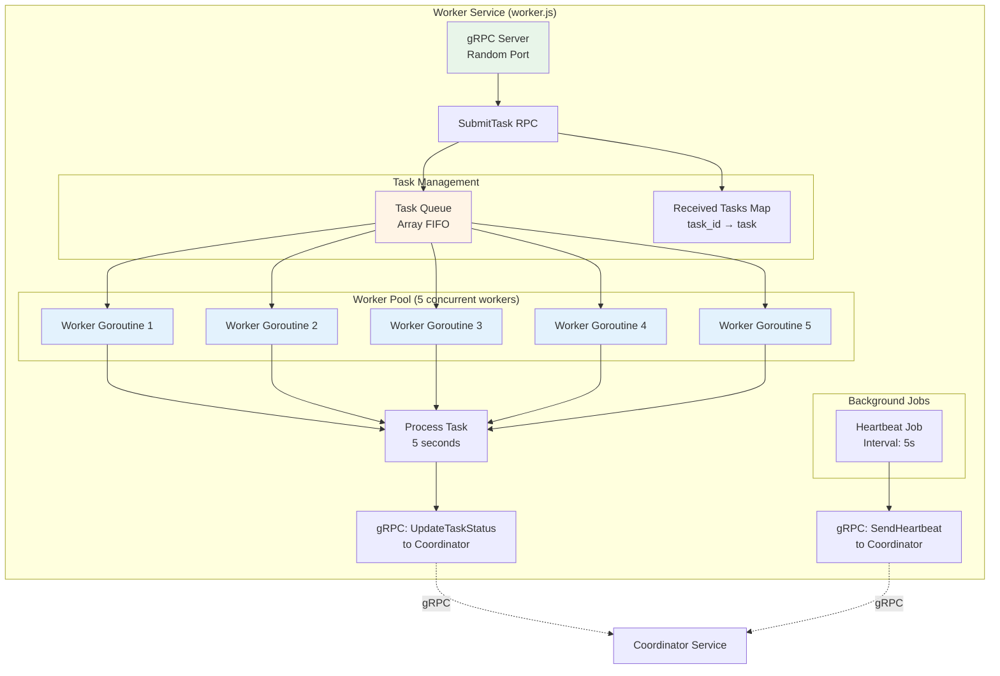
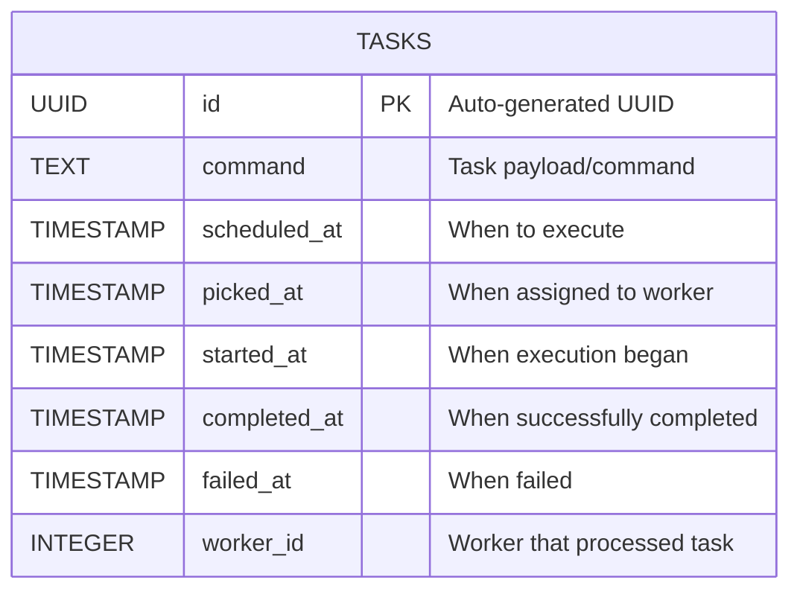
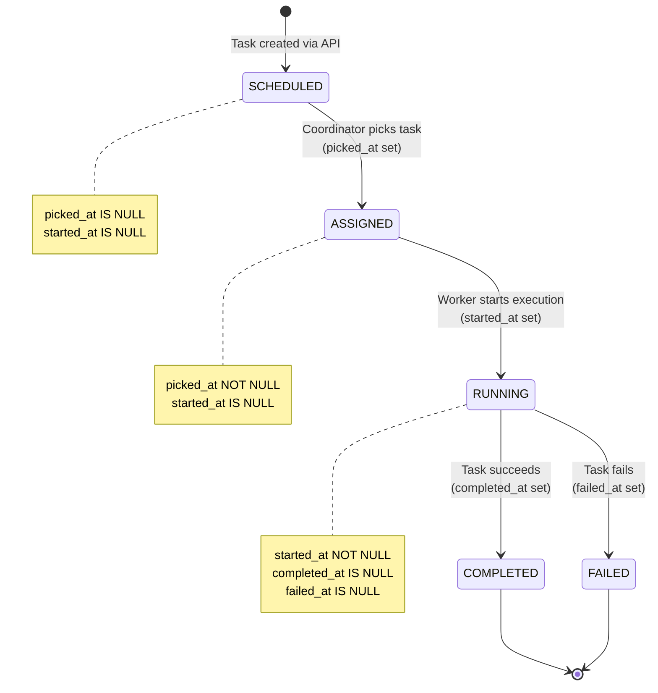
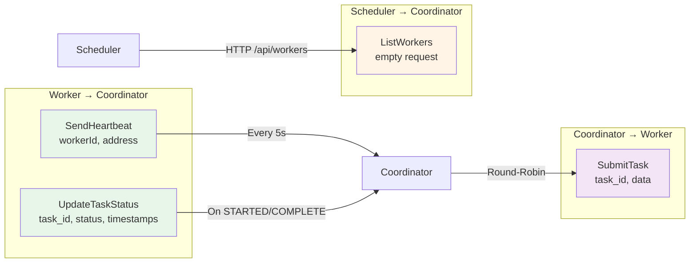
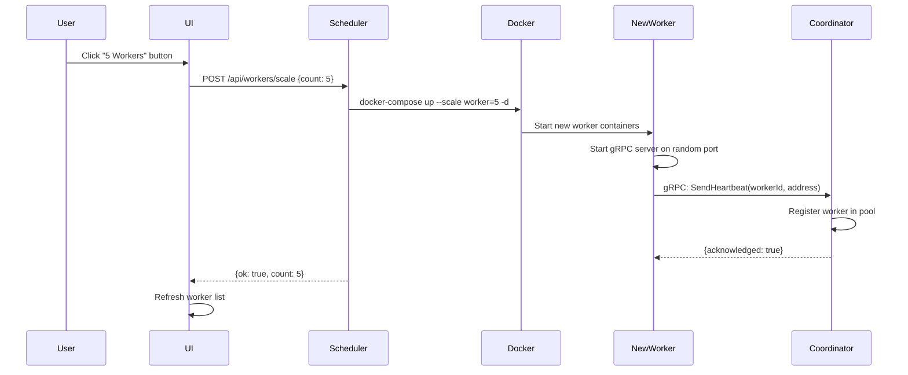
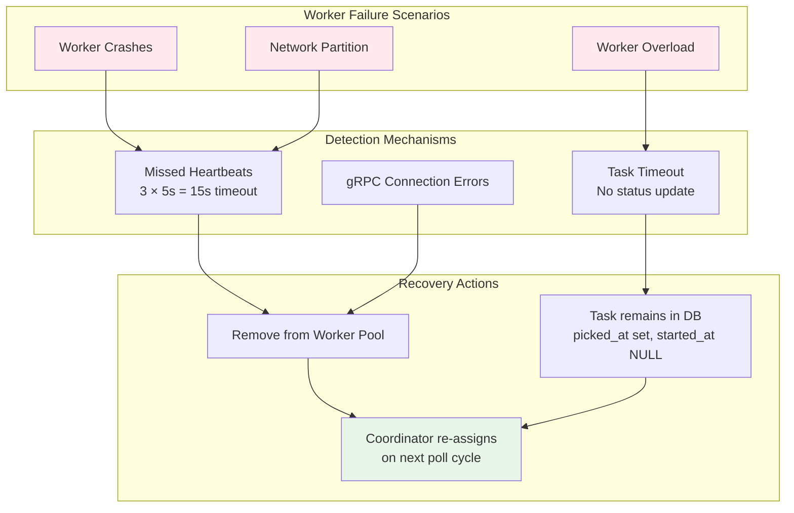

# TaskMaster Backend Architecture - Interview Guide

> **Purpose**: Visual diagrams to explain the distributed task scheduler backend architecture during technical interviews

---

## 1. System Overview - High-Level Architecture



**Key Points to Explain**:
- **4-Layer Architecture**: Client → API Gateway → Orchestration → Workers
- **Communication Protocols**: HTTP/REST for external, gRPC for internal microservices
- **Horizontal Scaling**: Workers can scale from 1 to 50+ instances
- **Centralized State**: PostgreSQL as single source of truth

---

## 2. Request Flow - Task Creation to Completion



**Key Points to Explain**:
- **Asynchronous Processing**: Task creation returns immediately, execution happens in background
- **Database Polling**: Coordinator scans every 10s with 30s lookahead window
- **Real-Time Updates**: Server-Sent Events (SSE) for live UI updates
- **Transaction Safety**: `FOR UPDATE SKIP LOCKED` prevents race conditions

---

## 3. Component Deep Dive - Internal Architecture

### 3.1 Scheduler Service (API Gateway)



**Key Responsibilities**:
1. **HTTP API**: Expose REST endpoints for task management
2. **SSE Streaming**: Broadcast real-time logs to connected clients
3. **Worker Scaling**: Execute Docker Compose commands to scale workers
4. **State Polling**: Detect task state transitions for live updates

---

### 3.2 Coordinator Service (Orchestration Engine)



**Key Algorithms**:

1. **Round-Robin Load Balancing**:
```javascript
getNextWorker() {
  if (workerPoolKeys.length === 0) return null;
  const worker = workerPool.get(
    workerPoolKeys[roundRobinIndex % workerPoolKeys.length]
  );
  roundRobinIndex++;
  return worker;
}
```

2. **Heartbeat-Based Worker Health**:
- Workers send heartbeat every 5s
- Coordinator allows 3 missed heartbeats (15s tolerance)
- Auto-removes inactive workers from pool

3. **Task Polling with Lookahead**:
```sql
SELECT id, command FROM tasks 
WHERE scheduled_at < (NOW() + INTERVAL '30 seconds') 
  AND picked_at IS NULL 
ORDER BY scheduled_at 
FOR UPDATE SKIP LOCKED
```

---

### 3.3 Worker Service (Task Executor)



**Key Design Patterns**:
1. **Internal Worker Pool**: 5 concurrent async workers per Worker instance
2. **Queue-Based Processing**: FIFO task queue with polling
3. **Graceful Shutdown**: Waits for all in-flight tasks to complete

---

## 4. Database Schema & Task Lifecycle



### Task State Machine



**Database Indexes**:
```sql
CREATE INDEX idx_tasks_scheduled_at ON tasks (scheduled_at);
CREATE INDEX idx_tasks_worker_id ON tasks (worker_id);
```

---

## 5. gRPC Communication Contracts



**Protocol Buffers Definition**:
```protobuf
service CoordinatorService {
  rpc SendHeartbeat (HeartbeatRequest) returns (HeartbeatResponse);
  rpc UpdateTaskStatus (UpdateTaskStatusRequest) returns (UpdateTaskStatusResponse);
  rpc ListWorkers (ListWorkersRequest) returns (ListWorkersResponse);
}

service WorkerService {
  rpc SubmitTask (TaskRequest) returns (TaskResponse);
}

enum TaskStatus {
  QUEUED = 0;
  STARTED = 1;
  COMPLETE = 2;
  FAILED = 3;
}
```

---

## 6. Scaling & Fault Tolerance

### Horizontal Scaling Flow



### Fault Tolerance Mechanisms



---

## 7. Technology Stack Summary

```mermaid
graph TB
    subgraph "Backend Stack"
        Node[Node.js 20<br/>Runtime]
        Express[Express.js<br/>HTTP Server]
        gRPC[gRPC + Protocol Buffers<br/>Inter-service Communication]
        PG[PostgreSQL 16<br/>Persistent Storage]
        Docker[Docker + Docker Compose<br/>Containerization]
    end
    
    subgraph "Key Libraries"
        L1[@grpc/grpc-js<br/>gRPC client/server]
        L2[pg<br/>PostgreSQL driver]
        L3[uuid<br/>Task ID generation]
    end
    
    Node --> Express
    Node --> gRPC
    Express --> L2
    gRPC --> L1
    Express --> L3
    
    style Node fill:#68a063
    style Express fill:#000000,color:#fff
    style gRPC fill:#244c5a,color:#fff
    style PG fill:#336791,color:#fff
    style Docker fill:#2496ed,color:#fff
```

---

## Interview Talking Points

### 1. **Why gRPC for Internal Communication?**
- **Performance**: Binary protocol, faster than JSON/HTTP
- **Type Safety**: Protocol Buffers enforce contracts
- **Bi-directional Streaming**: Future support for worker → coordinator push
- **Language Agnostic**: Easy to add workers in Go/Python/Java

### 2. **Why PostgreSQL over Redis/MongoDB?**
- **ACID Transactions**: Critical for task state consistency
- **SQL Queries**: Complex queries for task filtering
- **Persistence**: Tasks survive system restarts
- **`FOR UPDATE SKIP LOCKED`**: Built-in support for queue patterns

### 3. **Scalability Bottlenecks**
- **Database**: Single PostgreSQL instance (can add read replicas)
- **Coordinator**: Single instance (can implement leader election with Raft/etcd)
- **Workers**: Horizontally scalable to 100+ instances

### 4. **Production Improvements**
- Add Redis for distributed locking
- Implement task retries with exponential backoff
- Add metrics (Prometheus) and tracing (Jaeger)
- Use Kubernetes instead of Docker Compose
- Add authentication/authorization (JWT)

---

## Quick Reference - Port Mapping

| Service | Port | Protocol | Purpose |
|---------|------|----------|---------|
| React UI | 5173 | HTTP | User interface |
| Scheduler | 8081 | HTTP | REST API + SSE |
| Coordinator | 8080 | gRPC | Worker orchestration |
| Workers | Dynamic | gRPC | Task execution |
| PostgreSQL | 5432 | TCP | Database |

---

## File Structure Reference

```
taskmaster-master/
├── pkg/
│   ├── scheduler/scheduler.js    # HTTP API + SSE
│   ├── coordinator/coordinator.js # gRPC orchestration
│   ├── worker/worker.js          # Task execution
│   ├── common/common.js          # DB utilities
│   ├── grpcapi/api.proto         # gRPC contracts
│   └── db/setup.sql              # Database schema
├── cmd/
│   ├── scheduler/main.js         # Scheduler entry point
│   ├── coordinator/main.js       # Coordinator entry point
│   └── worker/main.js            # Worker entry point
└── docker-compose-node.yml       # Orchestration config
```
