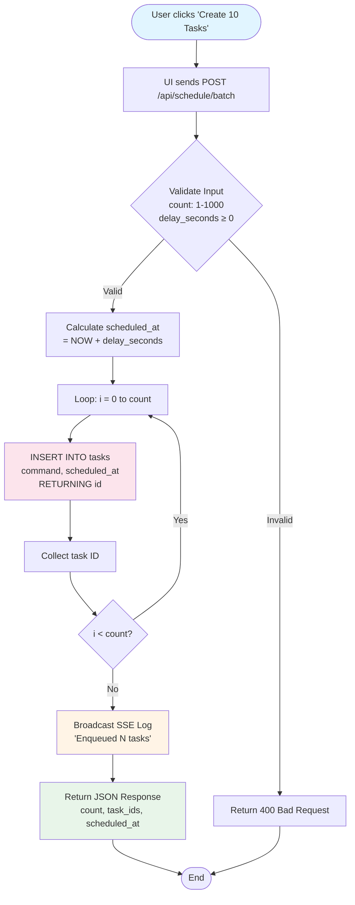
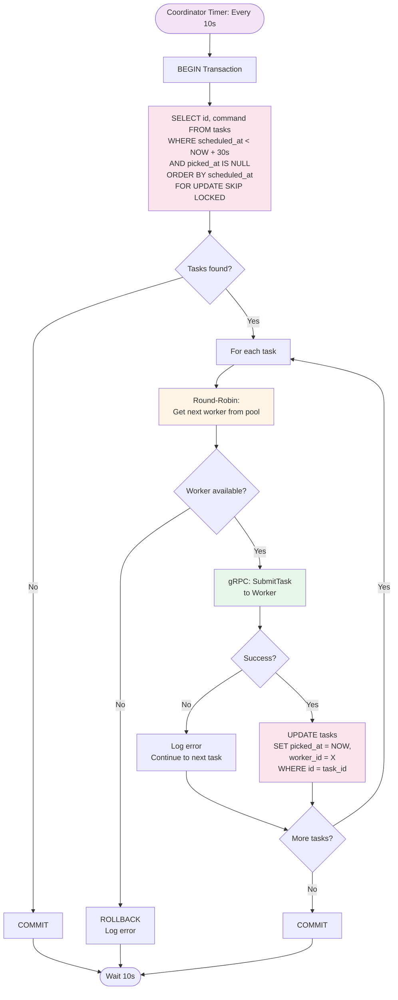
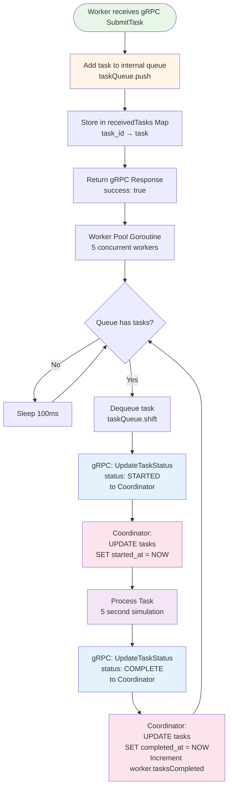
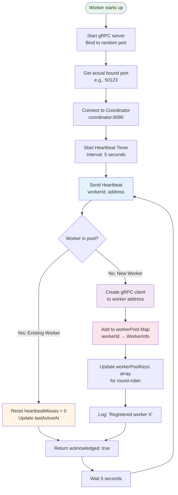
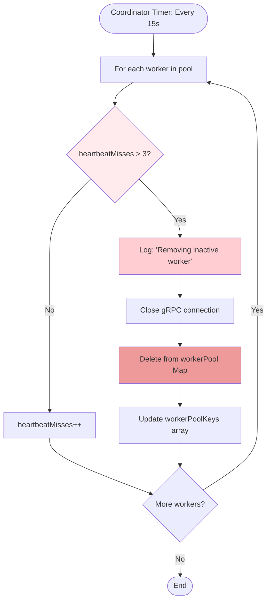
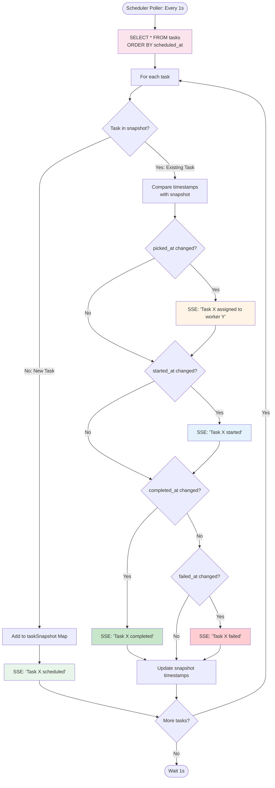
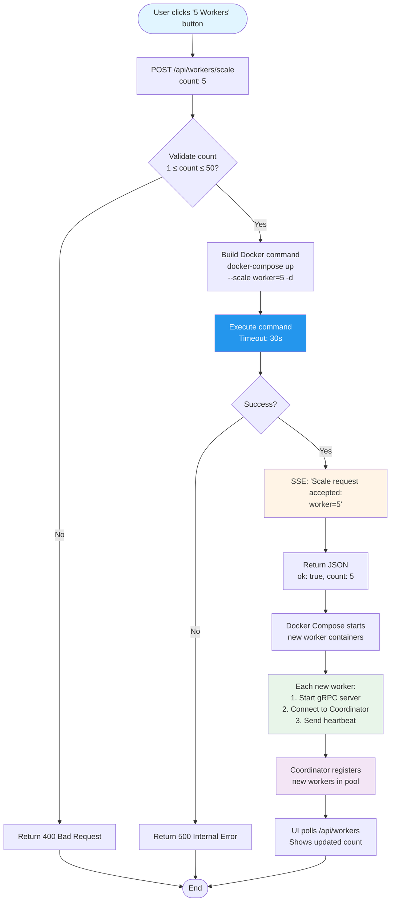
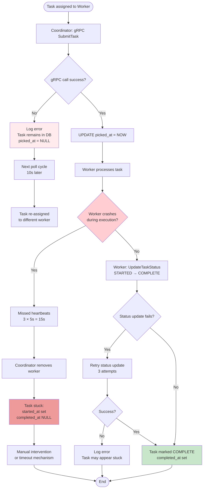
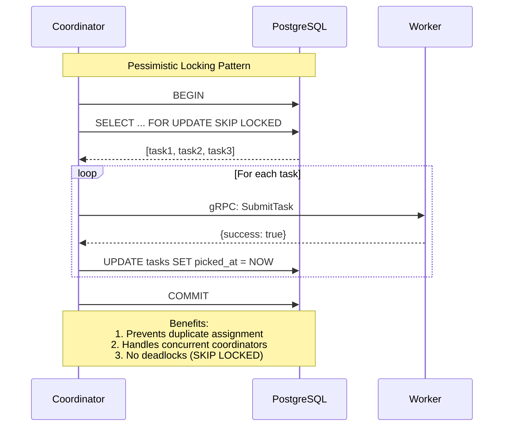
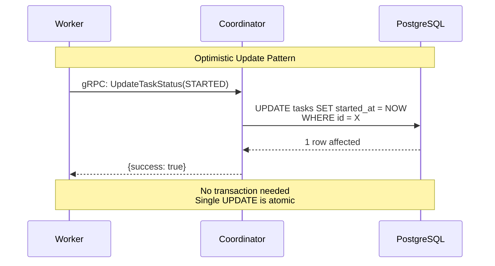

# Data Flow Diagrams - Request Processing Deep Dive

> **Purpose**: Detailed data flow diagrams showing how different types of requests are processed through the system

---

## 1. Task Creation Flow (Bulk Scheduling)



**Database Impact**:
- 10 tasks = 10 INSERT statements (can be optimized with batch INSERT)
- Each INSERT generates a UUID via `uuid_generate_v4()`
- Index `idx_tasks_scheduled_at` automatically updated

---

## 2. Task Assignment Flow (Coordinator Polling)



**Key Optimizations**:
- **30-second lookahead**: Batches multiple tasks in one transaction
- **SKIP LOCKED**: Prevents blocking if multiple coordinators (future-proof)
- **Transaction rollback**: Ensures consistency if worker submission fails

---

## 3. Worker Task Execution Flow



**Concurrency Model**:
- **5 worker goroutines** per Worker instance
- **Shared task queue** with mutex-free JavaScript (single-threaded event loop)
- **Blocking gRPC calls** ensure status updates complete before proceeding

---

## 4. Worker Heartbeat & Registration Flow



**Failure Detection**:


---

## 5. Real-Time UI Updates (SSE Flow)



**SSE Broadcasting**:
```javascript
broadcastLog(event) {
  const payload = { ts: new Date().toISOString(), ...event };
  logBuffer.push(payload); // Ring buffer: 250 events
  const data = `data: ${JSON.stringify(payload)}\n\n`;
  for (const client of sseClients) {
    if (!client.writableEnded) client.write(data);
  }
}
```

---

## 6. Worker Scaling Flow (Dynamic Scaling)



**Scaling Characteristics**:
- **Scale Up**: New workers auto-register via heartbeat
- **Scale Down**: Removed workers stop sending heartbeats, auto-removed after 15s
- **Zero Downtime**: Existing tasks continue processing during scaling

---

## 7. Error Handling & Retry Mechanisms



**Current Limitations** (Production TODOs):
- ❌ No automatic retry for stuck tasks
- ❌ No task timeout mechanism
- ❌ No exponential backoff for failed gRPC calls
- ✅ Worker failures detected via heartbeat
- ✅ Failed task assignments logged for monitoring

---

## 8. Database Transaction Patterns

### Pattern 1: Task Polling (Coordinator)



### Pattern 2: Status Updates (Worker → Coordinator)



---

## Performance Characteristics

| Operation | Latency | Throughput | Bottleneck |
|-----------|---------|------------|------------|
| Task Creation (Bulk) | ~50ms for 10 tasks | 200 tasks/sec | Database INSERTs |
| Task Assignment | ~100ms per task | 10 tasks/sec | gRPC round-trip |
| Task Execution | 5 seconds (simulated) | 5 tasks/worker/sec | Worker pool size |
| Heartbeat | ~10ms | 200 heartbeats/sec | Network latency |
| SSE Broadcast | ~5ms | 1000 events/sec | Client connections |

**Scaling Limits**:
- **Workers**: 50+ (limited by coordinator memory)
- **Tasks**: 1M+ (limited by database size)
- **SSE Clients**: 100+ (limited by scheduler memory)
- **Throughput**: 500+ tasks/sec with 100 workers (5 concurrent tasks each)
